# Rock Paper Scissors Lizard Spock game ✊ 🖐 ✌️ 🤏 🖖

The game serves as an expanded version of the classic 'Rock Paper Scissors' game, introducing two additional variables for players to choose from. Participants make their selections in unison. Notably, this iteration accommodates more than two players and the likelihood of a tie is significantly reduced. Victory is achieved by outplaying the majority of opponents. In cases of a tie, the game is reiterated until a clear winner emerges.

This specific application is designed for a two-player scenario, involving the user and the computer. Each game consists of 9 rounds, and the first player to secure 5 round victories will clinch the overall game triumph. Round scores will be visibly displayed beneath the available game icons. To initiate play, simply click the button below, make your icon selection, and the computer will then randomly make its choice to compete against you.

You can play the game on the live site [here](https://sasantazayoni.github.io/Rock-paper-scissors-lizard-spock-game-CI-PP2/).

## Table of Contents

- [User Experience](#user-experience)
  - [User stories](#user-stories)
  - [Design](#design)
    * [Overall feel](#overall-feel)
    * [Colour Scheme](#colour-scheme)
    * [Typography](#typography)
  - [Wireframes](#wireframes)
- [Features](#features)
  - [Current features](#current-features)
  - [Future features](#future-features)
- [Technologies used](#technologies-used)
  - [Languages used](#languages-used)
  - [Frameworks, libraries and programs used](#frameworks-libraries-and-programs-used)
- [Testing](#testing)
  - [Validator testing](#validator-testing)
  - [Testing User Stories from (UX) section](#testing-user-stories-from-ux-section)
  - [Personal testing](#personal-testing)
  - [Responsinator](#responsinator)
  - [Third-party testing](#third-party-testing)
  - [Lighthouse testing](#lighthouse-testing)
  - [PowerMapper Compatibility](#powermapper-compatibility)
  - [Other testing](#other-testing)
  - [Bugs](#bugs)
- [Deployment](#deployment)
- [Credits](#credits)

## User Experience

### User stories

* As a user, I want to immediately understand what the game is about and how it works.
* As a user, I want to play the game as soon as possible.
* As a user, I want a clear indication of my current score and to know my round result each time I play a round.
* As a user, I want to be able to keep a record of and track how many games I have won or lost overall.
* As a user, I want to be able to check the game instructions in case I forget how the game works.
* As a user, I want to be able to reset the record of game results.

### Design

#### Overall feel

Embodying a modern and captivating aesthetic, this application offers an overall ambience that is both contemporary and visually pleasing. While its primary role is to provide entertainment, it also serves as a valuable tool for resolving disagreements when consensus proves elusive.

#### Colour scheme

This carefully curated color combination blends bold contrasts and soothing shades to enhance user experience, infuse energy, and maintain visual clarity in our web application.

#### Typography

'Exo 2' is the font of choice in this application with a fallback of the font-stack 'Arial, Helvetica, sans-serif'. This was a deliberate decision to align with the game's dynamic and modern aesthetic. With its geometric letterforms and clean lines, Exo 2 effectively captures the energy and excitement that our game offers. Its legibility and versatility ensure that players can navigate effortlessly while being immersed in the vibrant experience we've crafted.

#### Wireframes

Comprehensive wireframes were developed to cater to all screen sizes. The decision to create single wireframes, without the need for variations in different screen sizes, was driven by the minimal impact on design elements beyond font and icon sizes. Explore the wireframes here:

The main game UI:  

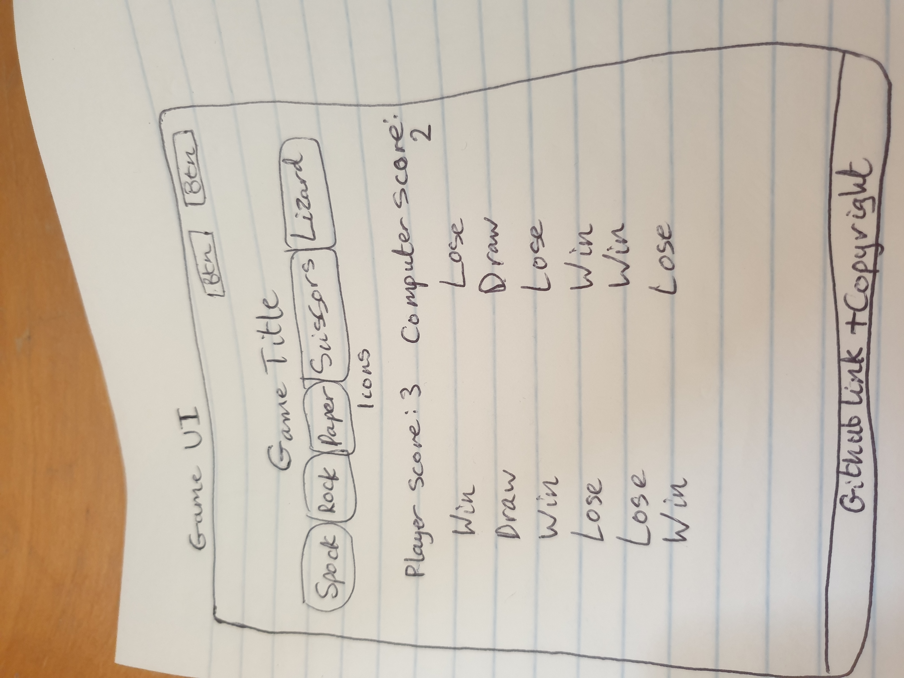  

The rules modal:  

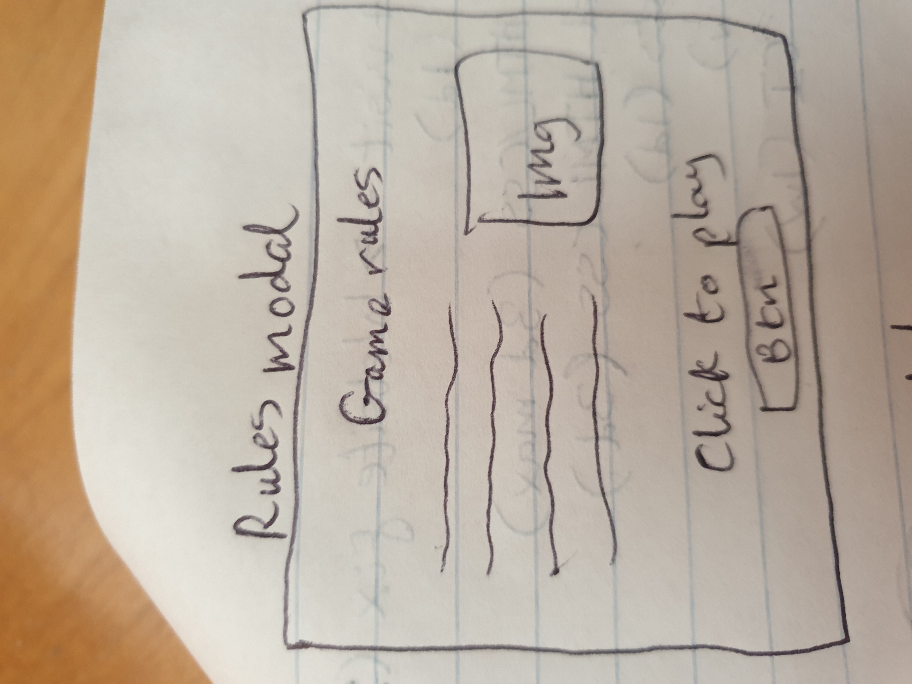  

The game scores modal:  

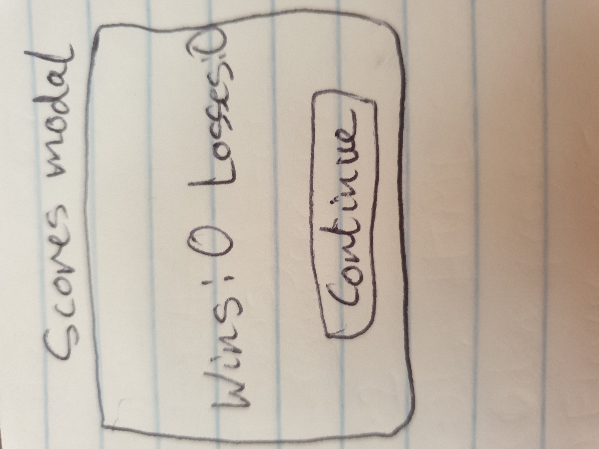  

The main game UI with an open modal:  

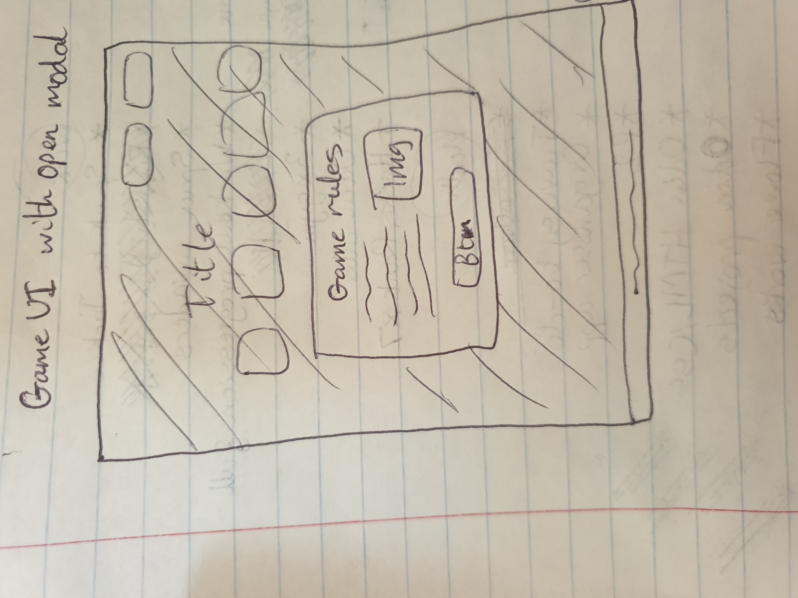  

## Features  

### Current features  

* The application is designed using Responsive Design and is fully responsive on all devices. This includes the modals and their content.
* All buttons have a neon hover effect when hovered over:  
    * Buttons:  
    
  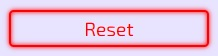
  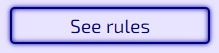
  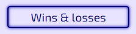
  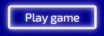
  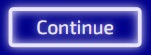

  * Buttons with hover effects:  

  
  
  
  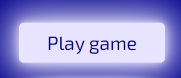
  
  
* The reset button has an additional pulse effect when clicked to indicate that the button has reset the game scores:  

  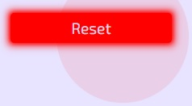

* Clicking on the "See rules" button opens the rules modal:  

  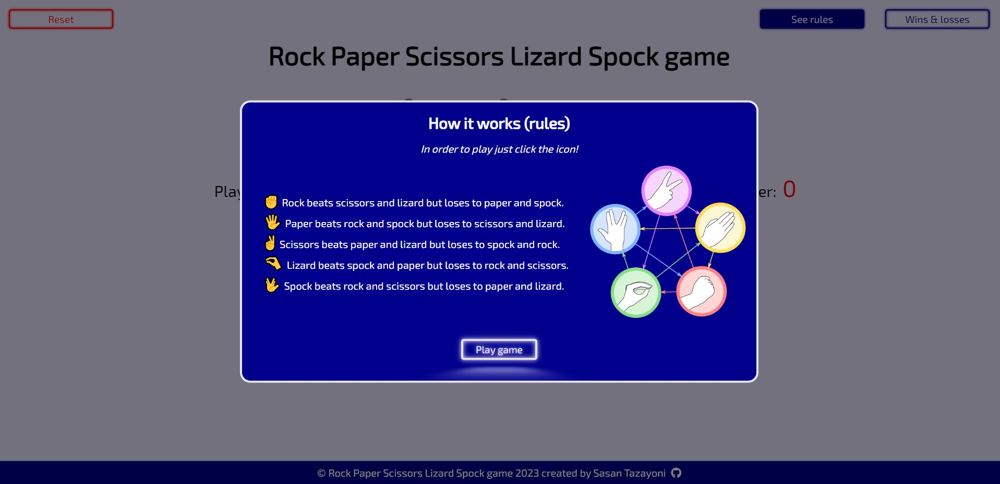

* Clicking on the "Wins & Losses" button opens the game scores modal:  

  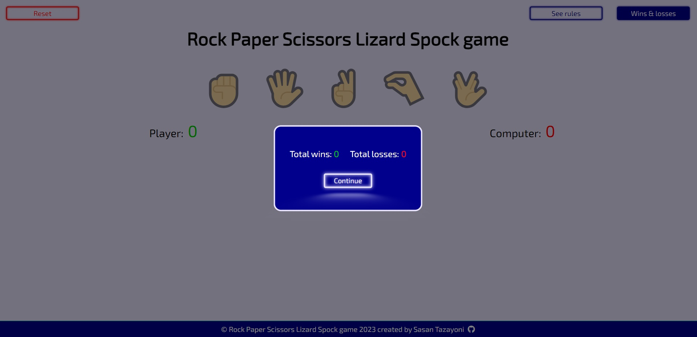

* Modals can be closed by clicking on the button corresponding to the modal or by clicking on the overlay.
* The game icons have a hover effect on them indicating that they can be clicked:  

  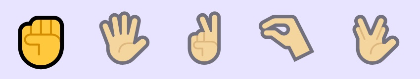

* Whenever an icon is clicked, it is compared against the computer's choice (which is random) and the UI is updated accordingly.
    * When the player wins, the round score of the player is incremented by 1 and the player's chosen icon is displayed with maximum opacity and slightly enlarged in the space beneath the player's round score while the computer's choice is displayed with partial opacity in the space beneath the computer's round score:  

    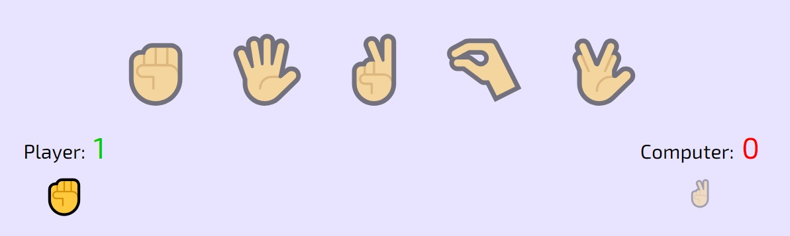

    * When the player loses, the round score of the computer is incremented by 1 and the computer's chosen icon is displayed with maximum opacity and slightly enlarged in the space beneath the computer's round score while the player's choice is displayed with partial opacity in the space beneath the player's round score:  

    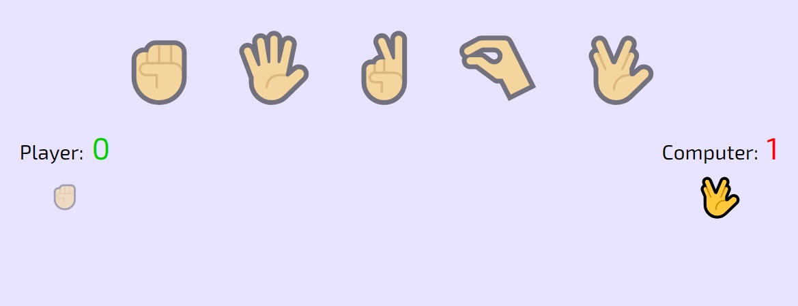

    * In the case of a draw, neither round is incremented and both chosen icons display with partial opacity beneath the respective scores
 
    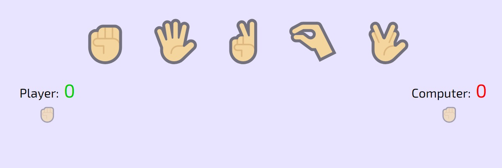

* After each round, the results are recorded both in the round scores and in the UI so that the player can see their previous choices as well as the computer's. For each round played, the icons selected will appear on top of the icons selected in the previous round (i.e. Older rounds will get pushed down the page). The viewport will extend in size if there are many round played:

    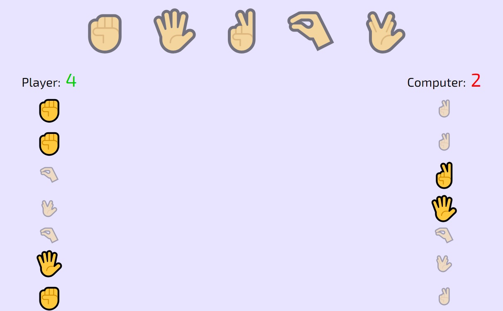

* The game ends when either the player or the computer has 5 round wins. This increments the game scores in the scores modal and is stored in local storage in case the player closes their browser. Text is dynamically inserted into the scores modal depending on whether the player has won or lost the game and then removed when the modal is closed:

    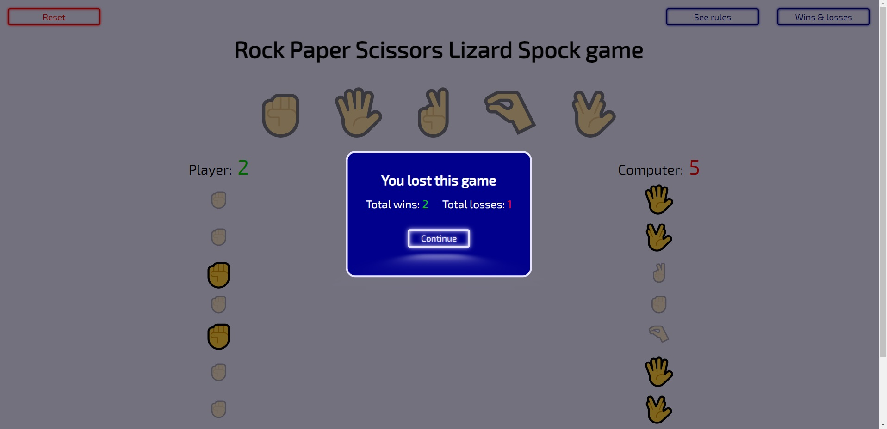
  
* When the modal is closed after a game end, the round scores reset to 0 for both the player and the computer and all added icons are removed from the page (the game is reset).
* The game scores (but not round scores) can be reset using the reset button in the main UI.

### Future features

* A voice recognition can be introduced for a better user experience. This should be able to open the rules, check the scores, close modals, reset and play the game by saying simple commands like "Rules" or "Scores" or "Lizard".
* A feature can be added to allow multiple players to play against each other.
* Sound effects can be added for better user experience.

## Technologies used

### Languages used

* HTML5
* CSS3
* JavaScript

### Frameworks, libraries and programs used

* [Font Awesome](https://fontawesome.com/) used for github icon.
* [Coolors](https://coolors.co/) used to display colour palette used on the website.
* [Google Fonts](https://fonts.google.com/) used to import 'Exo 2' font.
* [Github](https://github.com/) used to host repository.
* [Github pages](https://pages.github.com/) used to deploy the application.
* [Gitpod](https://www.gitpod.io/) used to develop project and organise version control.
* [Lighthouse](https://developer.chrome.com/docs/lighthouse/overview/) used for performance review.
* [Caniuse](https://caniuse.com/) used to check compatibility of code syntax with other browsers.
* [PowerMapper](https://www.powermapper.com/) used to check compatibility of website with other browsers.
* [Amiresposive](https://amiresponsive.co.uk/) used to display website on the most common devices.
* [Responsinator](http://www.responsinator.com/) used to check if site was responsive on different screen sizes.
* [ChatGPT](https://chat.openai.com/) used to verify code.
* [StackOverflow](https://stackoverflow.com/) used to problem solve and deal with queries.
* [Getemoji](https://getemoji.com/) used to obtain game icons.
* [Seekpng](https://www.seekpng.com/) used to obtain rules modal image.

## Testing

### Validator testing

I used the following websites to check my code for syntax errors:

* [HTML validator](https://validator.w3.org/)
* [CSS validator](https://jigsaw.w3.org/css-validator/)
* [JavaScript validator](https://jshint.com/)

### Testing User Stories from (UX) section

* As a user, I want to immediately understand what the game is about and how it works.
  * Upon opening the application the rules modal is already open. This explains the rules of the game and how to play.
  * Screenshot of the view when the application is opened:  

      
    
* As a user, I want to play the game as soon as possible.
  * The "play game" button (see previous screenshot) is clearly visible within the rules modal and on clicking gives access to the main game UI.
  * Alternatively the overlay can be clicked to close the modal and access the main game UI.  
  
* As a user, I want a clear indication of my current score and to know my round result each time I play a round.
  * The scores are clearly indicated in the main UI:  

    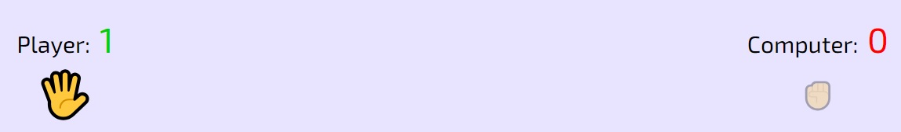  
* As a user, I want to be able to keep a record of and track how many games I have won or lost overall.
  * Clicking the "Wins & Losses" button in the main UI will display the game scores modal:  

      
* As a user, I want to be able to check the game instructions in case I forget how the game works.
  * Clicking the "See rules" button in the main UI will open a modal that displays the rules:  

      

* As a user, I want to be able to reset the record of game results.
  * Clicking the "Reset" button on the main UI which is visible in the main UI will achieve this:  

      

### Personal testing

* Samsung Galaxy S9
  * Samsung Internet
  * Microsoft Edge
  * Mozilla Firefox
  * Google Chrome
* iPhone 6
  * Safari
* iPhone SE
  * Safari
  * Google Chrome
* iPhone 12 Mini
  * Safari
* iPhone 14
  * Safari
* iPad 11" Pro
  * Safari
* Aorus 7
  * Google Chrome
  * Mozilla Firefox
  * Microsoft Edge
  * Opera
  * Brave

### Responsinator

Responsinator was used to make sure that the website was fully responsive on all devices. The results can be viewed [here](http://www.responsinator.com/?url=https%3A%2F%2Fsasantazayoni.github.io%2FRock-paper-scissors-lizard-spock-game-CI-PP2%2F).  
