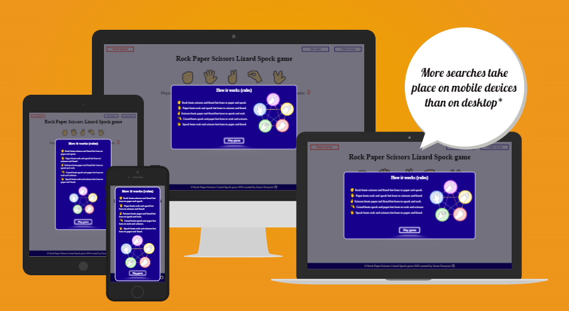
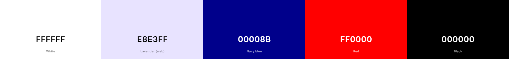

# Rock Paper Scissors Lizard Spock game ✊ 🖐 ✌️ 🤏 🖖

The game serves as an expanded version of the classic 'Rock Paper Scissors' game, introducing two additional variables for players to choose from. Participants make their selections in unison. Notably, this iteration accommodates more than two players and the likelihood of a tie is significantly reduced. Victory is achieved by outplaying the majority of opponents. In cases of a tie, the game is reiterated until a clear winner emerges.

This specific application is designed for a two-player scenario, involving the user and the computer. Each game consists of 9 rounds, and the first player to secure 5 round victories will clinch the overall game triumph. Round scores will be visibly displayed beneath the available game icons. To initiate play, simply click the button below, make your icon selection, and the computer will then randomly make its choice to compete against you.

You can play the game on the live site [here](https://sasantazayoni.github.io/Rock-paper-scissors-lizard-spock-game-CI-PP2/).

## Table of Contents

- [User Experience](#user-experience)
  - [User stories](#user-stories)
  - [Design](#design)
    * [Overall feel](#overall-feel)
    * [Colour Scheme](#colour-scheme)
    * [Typography](#typography)
  - [Wireframes](#wireframes)
- [Features](#features)
  - [Current features](#current-features)
  - [Future features](#future-features)
- [Technologies used](#technologies-used)
  - [Languages used](#languages-used)
  - [Frameworks, libraries and programs used](#frameworks-libraries-and-programs-used)
- [Testing](#testing)
  - [Validator testing](#validator-testing)
  - [Testing User Stories from (UX) section](#testing-user-stories-from-ux-section)
  - [Personal testing](#personal-testing)
  - [Responsinator](#responsinator)
  - [Third-party testing](#third-party-testing)
  - [Lighthouse testing](#lighthouse-testing)
  - [PowerMapper Compatibility](#powermapper-compatibility)
  - [Other testing](#other-testing)
  - [Bugs](#bugs)
- [Deployment](#deployment)
- [Credits](#credits)

## User Experience

### User stories

* As a user, I want to immediately understand what the game is about and how it works.
* As a user, I want to play the game as soon as possible.
* As a user, I want a clear indication of my current score and to know my round result each time I play a round.
* As a user, I want to be able to keep a record of and track how many games I have won or lost overall.
* As a user, I want to be able to check the game instructions in case I forget how the game works.
* As a user, I want to be able to reset the record of game results.

### Design

#### Overall feel

Embodying a modern and captivating aesthetic, this application offers an overall ambience that is both contemporary and visually pleasing. While its primary role is to provide entertainment, it also serves as a valuable tool for resolving disagreements when consensus proves elusive.

#### Colour scheme

This carefully curated color combination blends bold contrasts and soothing shades to enhance user experience, infuse energy, and maintain visual clarity in our web application.

#### Typography

'Exo 2' is the font of choice in this application with a fallback of the font-stack 'Arial, Helvetica, sans-serif'. This was a deliberate decision to align with the game's dynamic and modern aesthetic. With its geometric letterforms and clean lines, Exo 2 effectively captures the energy and excitement that our game offers. Its legibility and versatility ensure that players can navigate effortlessly while being immersed in the vibrant experience we've crafted.

#### Wireframes

Comprehensive wireframes were developed to cater to all screen sizes. The decision to create single wireframes, without the need for variations in different screen sizes, was driven by the minimal impact on design elements beyond font and icon sizes. Explore the wireframes here:

