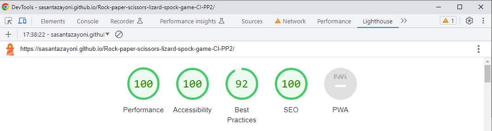
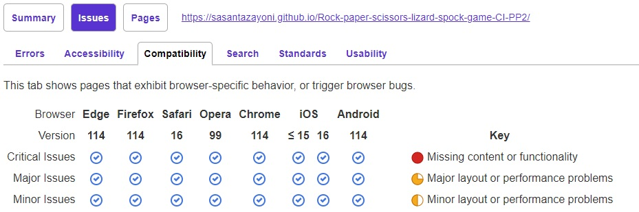

# Rock Paper Scissors Lizard Spock game ✊ 🖐 ✌️ 🤏 🖖

Introducing an enriched iteration of the classic 'Rock Paper Scissors' game, this version introduces two additional variables, elevating the decision-making process to new heights. Players make their selections simultaneously, infusing an element of suspense into each move. While this version is versatile enough for multiple players, this particular application is designed for a captivating two-player interaction, pitting the user against the computer. Triumph is attained by strategically outsmarting the computer's selections and selecting the icon that counters its choice. In the event of a tied match, a rematch ensues, persisting until a decisive victor emerges.

This tailored application revolves around a user-computer dynamic, featuring a sequence of 9 rounds per game. To clinch an overall victory, players must achieve 5 wins within these rounds to win a game. Round scores are prominently displayed below the array of game icons, providing a clear view of the ongoing battle.  Initiating gameplay is effortless: a simple click on the "Play game" button followed by a game icon (✊, 🖐, ✌️, 🤏, 🖖) in the main user interface and the computer will counter with its own randomised choice, culminating in an engaging clash of wits!

The two-player rendition of Rock Paper Scissors Lizard Spock offers a dynamic and interactive experience, delivering the thrill of competition without necessitating a human adversary. The game's succinct rounds and distinct outcomes cater to convenient entertainment, while the expanded choices and the challenge of predicting the AI's moves provide a rewarding sense of achievement. This approachable design, coupled with inherent replay value, encourages repeated engagement, promoting strategic thinking and ensuring continuous enjoyment.

You can play the game on the live site [here](https://sasantazayoni.github.io/Rock-paper-scissors-lizard-spock-game-CI-PP2/).

**Important note for assessors: While the project requirement specifies placing JavaScript code in external files just above the closing body tag, I have opted to enhance the project's performance and best practices by linking the JavaScript file using the 'defer' keyword in the head tag. This ensures an optimal loading sequence while adhering to recommended practices.**

## Table of Contents

- [User Experience](#user-experience)
  - [User stories](#user-stories)
  - [Design](#design)
    * [Overall feel](#overall-feel)
    * [Colour Scheme](#colour-scheme)
    * [Typography](#typography)
  - [Wireframes](#wireframes)
- [Features](#features)
  - [Current features](#current-features)
  - [Future features](#future-features)
- [Technologies used](#technologies-used)
  - [Languages used](#languages-used)
  - [Frameworks, libraries and programs used](#frameworks-libraries-and-programs-used)
- [Testing](#testing)
  - [Validator testing](#validator-testing)
  - [Testing User Stories from (UX) section](#testing-user-stories-from-ux-section)
  - [Personal testing](#personal-testing)
  - [Responsinator](#responsinator)
  - [Third-party testing](#third-party-testing)
  - [Lighthouse testing](#lighthouse-testing)
  - [PowerMapper Compatibility](#powermapper-compatibility)
  - [Bugs](#bugs)
- [Deployment](#deployment)
- [Credits](#credits)

## User Experience

### User stories

* As a user, I want to immediately understand what the game is about and how it works.
* As a user, I want to play the game as soon as possible.
* As a user, I want a clear indication of my current score and to know my round result each time I play a round.
* As a user, I want to be able to keep a record of and track how many games I have won or lost overall.
* As a user, I want to be able to check the game instructions in case I forget how the game works.
* As a user, I want to be able to reset the record of game results.

### Design

#### Overall feel

Embodying a modern and captivating aesthetic, this application offers an overall ambience that is both contemporary and visually pleasing. While its primary role is to provide entertainment, it also serves as a valuable tool for resolving disagreements when consensus proves elusive.

#### Colour scheme

This carefully curated color combination blends bold contrasts and soothing shades to enhance user experience, infuse energy, and maintain visual clarity in our web application.

#### Typography

'Exo 2' is the font of choice in this application with a fallback of the font-stack 'Arial, Helvetica, sans-serif'. This was a deliberate decision to align with the game's dynamic and modern aesthetic. With its geometric letterforms and clean lines, Exo 2 effectively captures the energy and excitement that our game offers. Its legibility and versatility ensure that players can navigate effortlessly while being immersed in the vibrant experience we've crafted.

#### Wireframes

Comprehensive wireframes were developed to cater to all screen sizes. The decision to create single wireframes, without the need for variations in different screen sizes, was driven by the minimal impact on design elements beyond font and icon sizes. Explore the wireframes here:

The main game UI:  

  

The rules modal:  

  

The game scores modal:  

  

The main game UI with an open modal:  

  

## Features  

### Current features  

* The application is designed using Responsive Design and is fully responsive on all devices. This includes the modals and their content.
* All buttons have a neon glow effect when hovered over for an enhanced user experience:  
    * Buttons:  
    
  
  
  
  
  

  * Buttons with hover effects:  

  
  
  
  
  
  
* The reset button has an additional pulse effect when clicked for clarity to indicate that the button has reset the game scores:  

  

* Clicking on the "See rules" button opens the rules modal (can be done at any time):  

  

* Clicking on the "Wins & Losses" button opens the game scores modal (can be done at any time):  

  

* Modals can be closed by clicking on the button corresponding to the modal or by clicking on the overlay.
* The game icons have a hover effect on them indicating that they can be interacted with:  

  

* Whenever an icon is clicked, it is compared against the computer's choice (which is random) and the UI is updated accordingly.
    * When the player wins, the round score of the player is incremented by 1 and the player's chosen icon is displayed with maximum opacity and slightly enlarged in the space beneath the player's round score while the computer's choice is displayed with partial opacity in the space beneath the computer's round score:  

    

    * When the player loses, the round score of the computer is incremented by 1 and the computer's chosen icon is displayed with maximum opacity and slightly enlarged in the space beneath the computer's round score while the player's choice is displayed with partial opacity in the space beneath the player's round score:  

    

    * In the case of a draw, neither round is incremented and both chosen icons display with partial opacity beneath the respective scores
 
    

* After each round, the results are recorded both in the round scores and in the UI so that the player can see their previous choices as well as the computer's. For each round played, the icons selected will appear on top of the icons selected in the previous round (i.e. Older rounds will get pushed down the page). The viewport will extend in size if there are many round played:

    

* The game ends when either the player or the computer has 5 round wins. This increments the game scores in the scores modal and is stored in local storage in case the player closes their browser. Text is dynamically inserted into the scores modal depending on whether the player has won or lost the game and then removed when the modal is closed:

    
  
* When the modal is closed after a game end, the round scores reset to 0 for both the player and the computer and all added icons are removed from the page (the game is reset).
* The game scores (but not round scores) can be reset using the reset button in the main UI.
* Each button has a sound effect when hovered over for an enhanced user experience.

### Future features

* A voice recognition can be introduced for a better user experience. This should be able to open the rules, check the scores, close modals, reset and play the game by saying simple commands like "Rules" or "Scores" or "Lizard".
* A feature can be added to allow multiple players to play against each other.
* More sound effects can be added for better user experience.

## Technologies used

### Languages used

* HTML5
* CSS3
* JavaScript

### Frameworks, libraries and programs used

* [Font Awesome](https://fontawesome.com/) used for github icon.
* [Coolors](https://coolors.co/) used to display colour palette used on the website.
* [Google Fonts](https://fonts.google.com/) used to import 'Exo 2' font.
* [Github](https://github.com/) used to host repository.
* [Github pages](https://pages.github.com/) used to deploy the application.
* [Gitpod](https://www.gitpod.io/) used to develop project and organise version control.
* [Lighthouse](https://developer.chrome.com/docs/lighthouse/overview/) used for performance review.
* [Caniuse](https://caniuse.com/) used to check compatibility of code syntax with other browsers.
* [PowerMapper](https://www.powermapper.com/) used to check compatibility of website with other browsers.
* [Amiresposive](https://amiresponsive.co.uk/) used to display website on the most common devices.
* [Responsinator](http://www.responsinator.com/) used to check if site was responsive on different screen sizes.
* [ChatGPT](https://chat.openai.com/) used to verify code.
* [StackOverflow](https://stackoverflow.com/) used to problem solve and deal with queries.
* [Getemoji](https://getemoji.com/) used to obtain game icons.
* [Seekpng](https://www.seekpng.com/) used to obtain rules modal image.
* [Epidemicsound](https://www.epidemicsound.com/) used to obtain sound hover effect for buttons.

## Testing

### Validator testing

I used the following websites to check my code for syntax errors:

* [HTML validator](https://validator.w3.org/)
* [CSS validator](https://jigsaw.w3.org/css-validator/)
* [JavaScript validator](https://jshint.com/)

### Testing User Stories from (UX) section

* As a user, I want to immediately understand what the game is about and how it works.
  * Upon opening the application the rules modal is already open. This explains the rules of the game and how to play.
  * Screenshot of the view when the application is opened:  

      
    
* As a user, I want to play the game as soon as possible.
  * The "play game" button (see previous screenshot) is clearly visible within the rules modal and on clicking gives access to the main game UI.
  * Alternatively the overlay can be clicked to close the modal and access the main game UI.  
  
* As a user, I want a clear indication of my current score and to know my round result each time I play a round.
  * The scores are clearly indicated in the main UI:  

      
* As a user, I want to be able to keep a record of and track how many games I have won or lost overall.
  * Clicking the "Wins & Losses" button in the main UI will display the game scores modal:  

      
* As a user, I want to be able to check the game instructions in case I forget how the game works.
  * Clicking the "See rules" button in the main UI will open a modal that displays the rules:  

      

* As a user, I want to be able to reset the record of game results.
  * Clicking the "Reset" button on the main UI which is visible in the main UI will achieve this:  

      

### Personal testing

* Samsung Galaxy S9
  * Samsung Internet
  * Microsoft Edge
  * Mozilla Firefox
  * Google Chrome
* iPhone 6
  * Safari
* iPhone SE
  * Safari
  * Google Chrome
* iPhone 12 Mini
  * Safari
* iPhone 14
  * Safari
* iPad 11" Pro
  * Safari
* Aorus 7
  * Google Chrome
  * Mozilla Firefox
  * Microsoft Edge
  * Opera
  * Brave

### Responsinator

Responsinator was used to make sure that the website was fully responsive on all devices. The results can be viewed [here](http://www.responsinator.com/?url=https%3A%2F%2Fsasantazayoni.github.io%2FRock-paper-scissors-lizard-spock-game-CI-PP2%2F).  

### Third-Party Testing

One of the most helpful ways to test the application was to have a few different people test it on various devices.

| Name | Age | Tech BG |
| --- | --- | --- |
| Joe | 35 | High |
| Varun | 32 | Low |
| Saba | 30 | High |

### Lighthouse testing

Lighthouse was a helpful tool for checking where where the website was experiencing the most issues.

The results show that the web application stands as an example of meticulous development, boasting exceptional scores across key criteria. With an unwavering commitment to inclusivity, the application achieves a perfect 100% for accessibility, ensuring that all users can seamlessly engage with its content. Fast loading times contribute to an impeccable 100% performance rating, enhancing the user experience. A strong 100% SEO score reflects the dedication to visibility and discoverability on the web. While the commitment to best practices is evident with a commendable 92%, the relentless pursuit of excellence in every facet is evident. This holistic approach culminates in an application that embodies both cutting-edge technology and user-centric design.

### PowerMapper Compatibility

As the results show, the website is highly compatible across all browsers.

### Bugs

* On a horizontal mobile view with specific phones, it is possible that the rules modal will not allow scrolling throughout the entire height of the modal (i.e. it may be possible that the title of the rules modal and the "Play game" button are inaccessible). This problem has been adjusted to work on most mobiles but not every mobile was available for testing.
* On Google Chrome by default the sound disabled when a new page is rendered - This means that the sound effect for the "Play game" button will initially not play but will after the first user interaction.

## Deployment

1. Log into [GitHub](https://github.com/).
2. Locate the [repository](https://github.com/SasanTazayoni/Rock-paper-scissors-lizard-spock-game-CI-PP2).
3. Locate the settings option along the options bar at the top of the page.
4. Locate the 'Pages' option on the left side bar and click on it.
5. Under the 'Branch' subheading there should be a drop-down menu - select 'Master' from the branch options.
6. Click the save button.
7. Github pages will build your website with the code supplied and begin hosting it when it is completed - the process usually takes a few minutes.
8. The website URL will now be visible on the green bar under the section header. This will remain there permanently and you can refer back to it at any time.

## Credits

* Thanks to [Kevin Powell](https://www.youtube.com/@KevinPowell) from YouTube for neon button hover-effect.
* Thanks to [WebDevSimplified](https://www.youtube.com/@WebDevSimplified) from YouTube for inspiration to build this project.
* Thanks to my friends and family for thoroughly testing out my web application and giving useful suggestions.
* Thanks to my mentor Antonio Rodriguez for the helpful direction in starting this project and all of the helpful resources provided that helped throughout.
